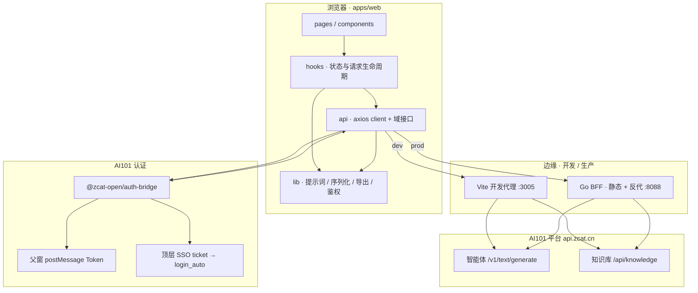

# NestEdu · 启芽智教（华科附幼智能工作与成长平台）

面向**华中科技大学附属幼儿园**一线教师的智能工作与成长平台（产品名 **NestEdu / 启芽智教**）：将 AI101 平台智能体、知识库与园所样表导出串联为**五入口闭环**——**活动方案 → 周计划 → 成果库 → 教师画像**，主教案/周计划文档以平台知识库为准；教师录入成果经 BFF `/api/v1/growth-records` 持久化（开发期可 `VITE_USE_BACKEND_API=false` 回退 localStorage）。

| | |
|---|---|
| 线上地址 | [https://nest.zcat.cn](https://nest.zcat.cn) |
| 接入形态 | AI101 主框架子模块（iframe + `@zcat-open/auth-bridge`），或浏览器顶层直访 + SSO ticket 换票 |
| 本地开发 | `pnpm install` → 配置 `.env` → `pnpm dev` → [http://localhost:3005](http://localhost:3005) |
| 仓库定位 | 由 `mvp-template`（React + Vite / Go + Gin）演进的业务 MVP，保留分层、OpenSpec 与统一 CI |

---

## 为什么这样设计

幼儿园教师的日常节奏是：**先按主题写多份领域教案，再汇总成一周活动表**。若把生成、入库、改稿、导出拆成多个孤立工具，上下文会在复制粘贴中丢失。NestEdu 把这条链路收敛成同一套鉴权与知识库作用域下的产品流：

1. **教案生成**：班级 + 重点领域 + 主题 → 智能体产出结构化教案 → 确认后写入教案分类。
2. **周计划生成**：从教案库勾选素材 → 智能体生成「快乐一周」周表 → 单元格编辑 / 对话改稿 → 导出或写入周计划分类。
3. **知识库为真**：列表、查看、删除、再导出均以平台知识库文档为准，避免双写与状态漂移。

```text
登录 AI101
  → 课程资源库「教案生成」→ 确认入库（分类 20806）
  → 周计划管理「周计划生成」→ 勾选教案 → 智能体出表 → 编辑 / 导出
  → 可选上传周计划知识库（分类 20807）
  → 同页「知识库管理」统一管理文档生命周期
```

---

## 系统架构

前端是主业务承载面；Go BFF 在生产侧负责静态托管、可选 CRUD 与同域反代。开发期可完全绕过 Go，由 Vite 将知识库 / 智能体 / 换票请求代理到平台。



### 分层约定

| 层 | 路径 | 职责边界 |
|----|------|----------|
| 页面装配 | `pages/` | 路由级编排，不直接写 `axios` / 不堆业务规则 |
| 交互组件 | `components/` | 可复用 UI 与局部交互（布局、对话框、编辑器） |
| 状态与副作用 | `hooks/` | 请求生命周期、列表同步、持久化上下文 |
| 接口适配 | `api/` | client、拦截器、知识库 / 智能体 / 周计划封装 |
| 纯逻辑 | `lib/` | 提示词拼装、文档解析、导出、校验、文本序列化 |
| HTTP | `apps/api/internal/http` | 协议、路由、编码 |
| 业务编排 | `internal/service` | 规则与跨 store 组合 |
| 持久化 | `internal/store` + `model` | 查询与模型（可选，非主数据真相源） |

---

## 功能一览

| 模块 | 路由 | 能力摘要 |
|------|------|----------|
| 首页 | `/` | 欢迎、快捷入口、真实统计（知识库 + 成果库）、个人成长闭环 |
| 活动方案 | `/activity` | 单次活动/教案生成、预览、入库；含知识库管理 |
| 周计划 | `/weekly-plan` | 周看板统筹、生成详细方案、保存入库、导出 |
| 成果库 | `/archive` | 系统统计 + 教师录入；筛选、卡片/时间轴、代表成果 |
| 教师画像 | `/profile` | 成长维度、趋势、优劣势、行动建议、年度报告 |

侧栏（桌面）/ 底部导航（移动端）五入口：**首页 · 活动方案 · 周计划 · 成果库 · 教师画像**。画像仅用于个人发展，不进行教师排名或绩效评分。

兼容跳转：`/resources` → `/activity`；`/weekly-plan/create`、`/weekly-plan/manage`、`/weekly-plan/history` → `/weekly-plan`。

### 周计划文档模型（「快乐一周」）

| 项 | 说明 |
|----|------|
| 表头 | 主题名称、班级、周次 |
| 周工作重点 | 本周核心目标与安排 |
| 日表四栏 | **自主学习 / 自主游戏 / 自主生活 / 自主运动**（周一至周五） |
| 实施建议 | 操作提示与注意事项 |
| 导出文件名 | `{班级}第{N}周计划.docx`（例：`小四班第7周计划.docx`） |

勾选教案按顺序对应周一至周五格子的生成依据；导出由 `lib/export-doc.ts` / `lib/export-pdf.ts` 完成。结构化类型见 `types/weeklyPlan`（`TeachingPlan` / `WeeklyPlan` / `DayPlan`）。

---

## 核心链路：从意图到文档

### 1. 鉴权（双通道，单 Token 出口）

```text
main.tsx
  → startAuthBridge()（lib/authBridge.ts）
  → iframe：父窗口 requestAuthInfo → Token
  → 顶层：VITE_AI101_LOGIN_ORIGIN/sso-login → ticket
       → /api/public/user/account/login_auto 换 Token
业务请求
  → axios 拦截器（api/client.ts）读取 authBridge → Authorization 等头
```

要点：

- 子模块**不自建账号体系**；信任父窗 origin 白名单（`VITE_AI101_PARENT_ORIGINS`），禁止 `*`。
- 未登录时生成与入库显式拦截，**不静默 Mock 成功结果**。
- 细节见 [docs/ai101-submodule-auth.md](docs/ai101-submodule-auth.md)。

### 2. 教案生成（智能体 `14317`）

```text
/resources「教案生成」
  → useTeachingResources.generateTeachingPlansFromTheme
  → api/llm.generateTeachingPlans
  → lib/prompts 拼装（主题、班级、重点领域）
  → api/agent.generateAgentText({ agentId: 14317 })
  → POST /v1/text/generate → 解析 JSON → TeachingPlan[]
  → 勾选 → UploadConfirmDialog → knowledge.upload（分类 20806）
```

重点领域（艺术 / 语言 / 科学 / 健康 / 社会）可多选，**按所选数量生成对应份数教案**，领域维度进入提示词而非事后手工拆分。

### 3. 周计划生成与改稿（智能体 `14332`）

```text
/weekly-plan「周计划生成」
  ① 班级 + 主题 + 周次（teachingContext 可持久化）
  ② 拉取教案分类 → PlanSelector 勾选
  ③ generateWeeklyPlan
       → 提示词 + 已选教案全文 + 知识库检索摘要
       → generateAgentText({ agentId: 14332 }) → WeeklyPlan
  ④ PlanEditor 双击单元格；AiChatPanel → modifyWeeklyPlan（同一 agent）
  ⑤ ExportToolbar → docx / pdf
  ⑥ 可选上传 → weeklyPlanKnowledgeScope（分类 20807）
```

改稿与生成共用智能体，保证「初次出表」与「对话修订」落在同一约束与输出形态上。

### 4. 文档管道：上传 ↔ 结构化 ↔ 导出

| 方向 | 实现要点 |
|------|----------|
| 上传 | docx 拖拽 → mammoth 抽文本 → 确认对话框 → `document/text` 写入知识库 |
| 入库后回读 | 列表 / 详情走 `api/knowledge.ts`；周计划侧 `parseWeeklyPlanFromDocument` 还原可编辑结构 |
| 导出 | `export-doc`（docx）/ `export-pdf` 按园所样表排版；文件名规则见上表 |

教案分类列表失败时可回退本地预设（`data/teachingPlans.ts`）；**周计划分类列表不回退预设**，避免脏数据进入园所正式周表。

---

## 知识库与智能体配置

同一知识库 **`10298`**，两个分类隔离读写：

| 用途 | 分类 ID | 平台链接 |
|------|---------|----------|
| 教案 | `20806` | [知识库 · 教案](https://www.zcat.cn/teach/knowledge/detail/10298?category_id=20806&category_key=custom_1784259353619) |
| 周计划 | `20807` | [知识库 · 周计划](https://www.zcat.cn/teach/knowledge/detail/10298?category_id=20807&category_key=custom_1784275664825) |

| 能力 | 智能体 | 配置变量 | 平台配置 |
|------|--------|----------|----------|
| 教案生成 | `14317` | `VITE_TEACHING_AGENT_ID` | [agent/14317](https://www.zcat.cn/teach/agent/config/14317) |
| 周计划生成 / AI 改稿 | `14332` | `VITE_WEEKLY_PLAN_AGENT_ID` | [agent/14332](https://www.zcat.cn/teach/agent/config/14332) |

调用约定：`POST /v1/text/generate`（用户 Token + `agent_id`）。失败直接表面错误；自动化链路须有明确终止条件（超时 / 明确失败 / 人工确认），见 [AGENTS.md](AGENTS.md)。

---

## 请求拓扑：开发代理 vs 生产同域

**本地（Vite `:3005`）** — `apps/web/vite.config.ts`：

| 前缀 | 目标 | 备注 |
|------|------|------|
| `/api/knowledge` | 平台知识库 | 须注册在 `/api/v1` **之前**，避免被 BFF 前缀吞掉 |
| `/v1` | 平台智能体 | 如 `/v1/text/generate` |
| `/api/public/user/account/login_auto` | AI101 换票 | 顶层直访 |
| `/api/v1` | 本地 Go（默认 `127.0.0.1:8088`） | 可选 |

**生产（Go）** — `internal/http/router.go`：

| 路径 | 行为 |
|------|------|
| `/api/v1/*` | 本服务 BFF（含周计划 CRUD 等可选能力） |
| `/api/knowledge`、`/v1/*` | 反向代理到 `PLATFORM_API_BASE_URL` |
| 静态资源 | `WEB_STATIC_DIR` 托管 SPA |

```text
浏览器
  ├─ 开发：Vite 代理 ──→ api.zcat.cn（知识库 / 智能体 / 换票）
  └─ 生产：同域 Go ──→ BFF 或反代 ──→ api.zcat.cn
```

推荐本地：`VITE_USE_BACKEND_API=false`，主流程不依赖 Go；生产可用 Docker 单镜像（多阶段：Node 构建前端 + Go 编译 BFF + Alpine 运行时）。

---

## 技术栈

### 前端 `apps/web`

| 技术 | 用途 |
|------|------|
| React 19 + TypeScript | 页面与组件；类型贯穿教案 / 周计划领域模型 |
| Vite 8 | 开发服务器、构建；开发期代理平台与可选本地 Go |
| Tailwind CSS v4 | 样式（`@tailwindcss/vite`）；松绿主题与 `surface-panel` 等工具类 |
| React Router | 路由与兼容重定向（`routes/index.tsx`） |
| axios | HTTP；拦截器注入 AI101 Token（`api/client.ts`） |
| `@zcat-open/auth-bridge` | iframe 父窗鉴权 / 顶层 ticket 换 token |
| docx / mammoth | Word 导出与上传解析 |
| sonner | Toast |
| Shadcn / Radix | 对话框等基础 UI（源码注入，便于样式共治） |

### 后端 `apps/api`（可选）

| 技术 | 用途 |
|------|------|
| Go + Gin | HTTP / BFF |
| GORM | 可选持久化（样例表、周计划 CRUD） |
| 反向代理 | 同域转发 `/api/knowledge`、`/v1` 到平台 |
| 静态托管 | `WEB_STATIC_DIR` 托管前端 `dist` |

分层：`internal/http` → `internal/service` → `internal/store` → `internal/model`。业务逻辑不堆回 `main.go`、匿名 handler 或临时 `gin.H`。

### 工程与交付

| 能力 | 说明 |
|------|------|
| pnpm workspace | 根脚本统一 `dev` / `build` / `lint` / `ci` |
| OpenSpec | 中大型变更先建 change，按 `tasks.md` 推进（`openspec/`） |
| 质量门槛 | `scripts/ci.sh`：前端 lint + build，后端 test + build |
| Docker | `docker/Dockerfile` 多阶段构建，构建期注入 `VITE_*` |
| 协作约定 | [AGENTS.md](AGENTS.md)、[docs/commit-convention.md](docs/commit-convention.md) |

---

## 仓库结构

```text
.
├── apps/
│   ├── web/                      # React 前端
│   │   ├── src/
│   │   │   ├── api/              # agent / knowledge / llm / client / weeklyPlan
│   │   │   ├── hooks/            # useTeachingResources / useWeeklyPlan / …
│   │   │   ├── pages/
│   │   │   │   ├── dashboard/    # 首页
│   │   │   │   ├── resources/    # 课程资源库（教案生成 + 知识库管理）
│   │   │   │   └── weekly-plan/  # 周计划管理（生成 + 知识库管理）
│   │   │   ├── components/       # 布局、通用 UI、编辑器与对话面板
│   │   │   ├── lib/              # 鉴权、提示词、导出、文本序列化
│   │   │   ├── types/            # 领域类型
│   │   │   └── routes/
│   │   └── vite.config.ts        # 开发代理（知识库 / 智能体 / 换票 / 可选 Go）
│   └── api/                      # Go BFF
│       ├── cmd/server/
│       └── internal/             # http / service / store / model / config
├── docs/                         # 架构、接口、认证、编码规范
├── docker/                       # 多阶段构建 Dockerfile
├── scripts/                      # ci 等脚本
├── openspec/                     # 变更规格
├── AGENTS.md                     # 协作者 / AI 约定
└── .env.example                  # 环境变量模板（复制为根目录 .env）
```

---

## 界面与交互要点

- **视觉**：松绿主题（松针绿侧栏 + 雾绿内容底），Noto Sans / Serif 中文字体，统一 `surface-panel`、主按钮等样式工具类。
- **班级**：大班 / 中班 / 小班选择器，教案与周计划共用。
- **重点领域**（教案）：艺术、语言、科学、健康、社会，可多选。
- **上传**：docx 拖拽 → 前端抽文本 → 确认后再写入知识库。
- **周计划编辑**：表格双击单元格改写；侧栏「AI 修改」对话改稿；可导出 DOC / PDF。

---

## 本地启动

### 前置

- Node.js（建议 LTS）+ [pnpm](https://pnpm.io/) 11+
- 可选：Go 1.22+（仅当需要跑 `apps/api`）

### 前端（日常开发足够）

```bash
pnpm install
cp .env.example .env   # Windows: copy .env.example .env
# 按下方「推荐本地配置」改好根目录 .env
pnpm dev               # http://localhost:3005
```

推荐本地配置（根目录 `.env`）：

```bash
VITE_USE_BACKEND_API=false
VITE_AI101_DIRECT_AUTH=true
VITE_DEFAULT_KNOWLEDGE_ID=10298
VITE_DEFAULT_KNOWLEDGE_CATEGORY_ID=20806
VITE_WEEKLY_PLAN_KNOWLEDGE_CATEGORY_ID=20807
VITE_TEACHING_AGENT_ID=14317
VITE_WEEKLY_PLAN_AGENT_ID=14332
VITE_PLATFORM_API_BASE_URL=https://api.zcat.cn
```

改 `VITE_*` 后需**重启 Vite** 才会生效（编译期注入）。

### 可选：本地 Go（SQLite）

```bash
cd apps/api
# PowerShell 示例：
$env:DB_DRIVER='sqlite'; $env:DB_DSN='./data/mvp.db'; $env:DB_AUTO_MIGRATE='true'
go run ./cmd/server
# 或仓库根目录：pnpm dev:backend
```

默认监听 `:8088`。`VITE_USE_BACKEND_API=false` 时前端主流程不依赖该服务。

---

## 常用命令

```bash
pnpm dev            # 前端开发
pnpm lint           # 前端 lint
pnpm build          # 前端生产构建
pnpm preview        # 预览构建产物
pnpm build:backend  # Go 编译检查
pnpm test:backend   # Go 测试
pnpm run ci         # 统一 CI 脚本（scripts/ci.sh）
```

中大型改动建议先走 OpenSpec：

```bash
./scripts/openspec-new-change.sh <change-id>
```

---

## 环境变量（摘要）

加载顺序：根 `.env` → `apps/*/.env` → `.env.local` → **进程环境**（最高优先级）。

| 变量 | 含义 |
|------|------|
| `VITE_USE_BACKEND_API` | `false`：教案/周计划走前端智能体（推荐本地） |
| `VITE_DEFAULT_KNOWLEDGE_*` | 教案知识库 ID / 分类 20806 及 category_key |
| `VITE_WEEKLY_PLAN_KNOWLEDGE_CATEGORY_*` | 周计划分类 20807 及 category_key |
| `VITE_TEACHING_AGENT_ID` / `VITE_WEEKLY_PLAN_AGENT_ID` | 教案 14317 / 周计划 14332 |
| `VITE_PLATFORM_API_BASE_URL` / `VITE_PLATFORM_REFERER` | 平台 API 与代理 Referer |
| `VITE_AI101_*` | 登录、父窗口白名单、换票 |
| `VITE_BASE_PATH` | 前端部署子路径（默认同域根路径） |
| `PLATFORM_*` / `KNOWLEDGE_*_PATH` | Go 反代与 BFF 知识库路径 |
| `DB_DRIVER` / `DB_DSN` | 后端数据库 |
| `LOCAL_API_BASE_URL` | Vite 把 `/api/v1` 代理到的本地 Go 地址 |

完整说明见 [`.env.example`](.env.example)。本地 `.env` 已 gitignore，**勿提交密钥与 Token**。

---

## Docker 部署

```bash
docker build -f docker/Dockerfile -t nestedu:local .
docker run --rm -p 8088:8088 \
  -e DB_DRIVER=sqlite \
  -e DB_DSN=/app/data/mvp.db \
  -e DB_AUTO_MIGRATE=true \
  nestedu:local
```

镜像结构：

1. **web stage**：Node 24 + pnpm frozen install → Vite 生产构建（`VITE_*` 构建期注入）
2. **api-builder**：Go 1.25，`-trimpath -ldflags="-s -w"` 产出精简二进制
3. **runtime**：Alpine + `mvp-api` + 前端 `dist`，默认 SQLite，`WEB_STATIC_DIR` 指向静态资源

注意：

- 改 `VITE_*` 需重新 `docker build`。
- 生产构建请带上正确的知识库 / 智能体 / AI101 相关变量。
- 知识库或智能体返回 401 时，请先在页面登录平台账号。

---

## 可靠性与安全边界（摘要）

| 原则 | 落地 |
|------|------|
| 不静默假成功 | 智能体 / 入库失败直接报错，无 Mock 降级冒充成功 |
| 知识库为真相源 | 不以本地历史表覆盖平台文档；周计划列表不回退预设 |
| 认证边界清晰 | iframe 仅信白名单 origin；顶层仅接受短期 ticket 换票 |
| 自动化可终止 | Agent / 外部调用须有超时、明确失败或人工确认（见 AGENTS.md） |
| 密钥不入库 | `.env` gitignore；构建与运行配置分离 |

---

## 常见问题

| 现象 | 处理 |
|------|------|
| 生成 / 上传提示未登录 | 点右上角登录；确认 `VITE_AI101_DIRECT_AUTH=true` 且换票代理可用 |
| 智能体报错、无结果 | 检查 Agent ID、Token、平台侧智能体是否可用；本产品不静默 Mock |
| 改了 `.env` 不生效 | 重启 `pnpm dev`；Docker 需重新 build |
| 知识库列表为空 | 确认已登录、分类 ID 正确；教案侧才有本地预设回退 |
| 本地要起后端 | 用 SQLite 配置，避免默认 Postgres 连不上 |
| `/api/knowledge` 被错误路由 | 确认 Vite 代理中知识库前缀写在 `/api/v1` 之前 |

---

## 文档索引

| 文档 | 内容 |
|------|------|
| [docs/architecture.md](docs/architecture.md) | 系统架构 |
| [docs/api-contract.md](docs/api-contract.md) | 接口与智能体 / 知识库约定 |
| [docs/ai101-submodule-auth.md](docs/ai101-submodule-auth.md) | AI101 子模块认证 |
| [docs/优雅代码指南.md](docs/优雅代码指南.md) | 编码规范 |
| [docs/commit-convention.md](docs/commit-convention.md) | 提交约定 |
| [AGENTS.md](AGENTS.md) | 协作者 / AI 协作约定 |
| [openspec/README.md](openspec/README.md) | 变更规格流程 |
| [docs/mvp-template-usage-guide.md](docs/mvp-template-usage-guide.md) | 模板用法 |
| [docs/upgrade-from-legacy.md](docs/upgrade-from-legacy.md) | 旧项目升级 |

本仓库由 MVP 模板演进而来；与模板仓库共享历史时可添加 `template` remote，模板同步建议单独提交。
