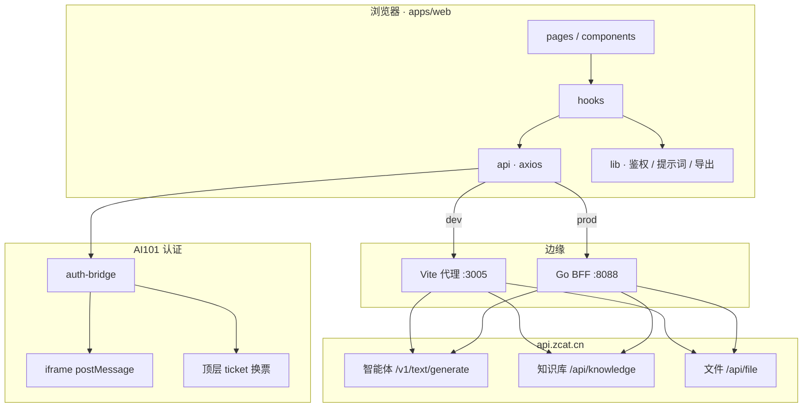

# NestEdu · 启芽智教

面向**华中科技大学附属幼儿园**一线教师的智能工作与成长平台。在 AI101 智能体与知识库之上，把**活动方案生成 → 周计划编排 → 成果沉淀 → 教师画像**收成同一套鉴权与数据闭环，而不是几个互不连通的生成小工具。

| | |
|---|---|
| 线上地址 | [https://nest.zcat.cn](https://nest.zcat.cn) |
| 接入形态 | AI101 子模块（iframe + `@zcat-open/auth-bridge`），或顶层直访 + SSO ticket 换票 |
| 本地开发 | `pnpm install` → 配置根目录 `.env` → `pnpm dev` → [http://localhost:3005](http://localhost:3005) |
| 协作规范 | [AGENTS.md](AGENTS.md) · 变更记录 [CHANGELOG.md](CHANGELOG.md) |

---

## 项目总结

**NestEdu（华科附幼智能教案助手 / 启芽智教）** 面向华中科技大学附属幼儿园一线教师的智能工作与成长平台。在 AI101 智能体与知识库之上，串联**活动方案生成 → 周计划编排 → 成果沉淀 → 教师画像**完整闭环；基于 Go + Gin 搭建 BFF，对接 AI101 智能体、知识库与文件服务，完成方案/周计划生成、多格式成果入库、Word/PDF 导出与画像解读。生产环境由 Go 统一托管前端静态资源，并同域反向代理平台 API，避免浏览器跨域与 Cookie 隔离问题。

### 1. Go BFF 分层架构

基于 Gin 按 **`http / service / store / model`** 四层拆分：对外提供周计划 CRUD、教师成果录入（`growth_records`）、本人入库计数（`teacher_generated_docs`）、画像快照（`profile_snapshots`）及知识库封装等 **`/api/v1`** 接口。`KnowledgeService` 在上传时强制纠正业务分类（教案库 / 周计划库），避免文档误入教师成果库或手机号文件夹。GORM + **MySQL** 持久化业务数据（本地 Docker / 生产 RDS），HTTP 协议层与业务编排解耦。

### 2. 平台网关与鉴权透传

生产环境 Go 中间件反代 **`/api/knowledge`、`/api/file`、`/api/user`、`/api/ai`、`/v1/*`**，同域收敛跨域；开发期 Vite 代理相同前缀至 `api.zcat.cn`。`@zcat-open/auth-bridge` 支持 iframe postMessage 取 Token 与顶层 SSO ticket 换票；axios 拦截器自动注入 `Authorization`、`X-Uid-Hash` 等鉴权头，未登录显式拦截，**不静默 Mock 成功**。

### 3. 智能体调用与文档处理

对接平台 **`POST /v1/text/generate`**，活动方案 / 周计划 / 教师画像分 Agent 调用（`14317` / `14332` / `14372`）；前端拼装提示词、解析结构化输出，画像侧注入本人活动/周计划摘要。知识库 **`10368`** 三分类隔离（教案 `20806` / 周计划 `20807` / 教师成果库 `20895`）；成果库按**登录手机号**匹配个人文件夹。文档侧支持 mammoth 解析 Word、**先 `/api/file/upload` 再登记知识库**的多格式上传（教案库 / 周计划库 / 教师成果库同一格式清单），以及 docx/PDF 自主导出。

### 4. 工程化交付

**pnpm monorepo** 统一依赖与脚本（`pnpm dev` / `pnpm run ci`）；**Docker 多阶段构建**（Node 打包前端 → Go 编译 BFF → Alpine 运行时），单镜像完成静态托管、BFF 与平台反代。OpenSpec 管理中大型变更，Conventional Commits 轻量提交。

---

## 产品定位

教师日常需要：按主题写领域活动方案、汇总成「快乐一周」周表、沉淀个人成果、回顾自身成长。NestEdu 用五入口承载这条链路：

```text
登录 AI101
  → 活动方案：主题 + 领域 → 智能体生成 → 入库教案库（+ MySQL 本人计数）
  → 周计划：勾选方案 → 智能体出表 → 编辑 / 导出 → 入库周计划库
  → 成果库：平台「教师成果库」个人文件夹（手机号同名）+ 多格式上传
  → 教师画像：聚合本人成果与生成计数 → 智能解读（可落库快照）
```

硬约束：

- **正式教案 / 周计划**以 AI101 知识库为准；本地 MySQL 存本人入库计数、成果录入、画像快照等。
- 活动方案 / 周计划入库目标为业务分类（教案库 / 周计划库），**禁止误入教师成果库手机号文件夹**。
- 成果库按**登录手机号**匹配同名个人文件夹，仅可见 / 可上传到本人目录。
- 画像用于个人发展观察，**不做教师排名或绩效评分**。
- 智能体 / 上传失败显式报错，**不静默 Mock 成功**；自动化须有超时或明确失败条件。

---

## 功能一览

侧栏（桌面）/ 底部导航（移动端）五入口：

| 模块 | 路由 | 能力 |
|------|------|------|
| 首页 | `/` | 欢迎、快捷入口、三项真实统计（活动方案 / 周计划 / 教师成果库）、成长闭环入口 |
| 活动方案 | `/activity` | 左右工作台生成与预览；知识库管理（本人入库 / 平台分类）；导出 |
| 周计划 | `/weekly-plan` | 五列周看板；生成、单元格编辑、AI 改稿；入库与 Word/PDF 导出 |
| 成果库 | `/archive` | 平台教师成果库（手机号文件夹）列表 / 预览 / 删除；多格式上传；三项汇总统计 |
| 教师画像 | `/profile` | 成长结构聚合 + 智能画像解读；快照落库后登录可回显 |

兼容重定向：`/resources` → `/activity`；旧周计划子路径 → `/weekly-plan`。

### 知识库上传（教案 / 周计划 / 成果库）

支持 Word、PDF、PPT、Excel、图片与常见文本（单文件建议 ≤ 50MB）。流程为：先 `POST /api/file/upload`，再登记对应分类（教案库 / 周计划库 / 教师成果库个人文件夹）；登记失败则回退 `document/text`，写入可检索说明与原文件链接。智能生成的活动方案 / 周计划仍以文本文档入库。

### 周计划文档模型（「快乐一周」）

| 项 | 说明 |
|----|------|
| 表头 | 主题、班级、周次 |
| 周工作重点 | 本周核心目标 |
| 日表四栏 | 自主学习 / 自主游戏 / 自主生活 / 自主运动（周一至周五） |
| 导出 | `{班级}第{N}周计划.docx` 等；实现见 `lib/export-doc.ts` / `lib/export-pdf.ts` |

---

## 系统架构

前端承载主业务；Go BFF 在生产侧托管静态资源、可选 CRUD，并同域反代平台 API。日常本地可只起 Vite，由代理直连平台。



### 分层约定

| 层 | 路径 | 职责 |
|----|------|------|
| 页面 | `apps/web/src/pages/` | 路由级装配 |
| 组件 | `components/` | 可复用 UI 与局部交互 |
| 状态 | `hooks/` | 请求生命周期与列表同步 |
| 接口 | `api/` | client、知识库、智能体、BFF 封装 |
| 纯逻辑 | `lib/` | 提示词、导出、校验、聚合 |
| HTTP | `apps/api/internal/http` | 协议与路由 |
| 业务 | `internal/service` | 编排与规则 |
| 持久化 | `internal/store` + `model` | GORM / 模型 |

---

## 知识库与智能体

同一知识库 **`10368`**，分类隔离：

| 用途 | 分类 ID | 说明 |
|------|---------|------|
| 教案 / 活动方案 | `20806` | 教案知识库管理 |
| 周计划 | `20807` | 周计划管理 |
| 教师成果库 | `20895` | 下挂手机号同名个人文件夹 |

| 能力 | Agent ID | 环境变量 |
|------|----------|----------|
| 活动方案生成 | `14317` | `VITE_TEACHING_AGENT_ID` |
| 周计划生成 / 改稿 | `14332` | `VITE_WEEKLY_PLAN_AGENT_ID` |
| 教师画像解读 | `14372` | `VITE_PROFILE_AGENT_ID` |

调用：`POST /v1/text/generate`（用户 Token + `agent_id`）。画像提示词由前端注入**本人**成果与活动/周计划摘要，勿挂整库自动检索。

入库标题约定：`姓名_活动方案_主题.md` / `姓名_周计划_主题.md`（不含手机号，避免平台智能分类进成果库）。

---

## 本地数据（MySQL / 可选）

在平台知识库之外，BFF 可持久化：

| 表 / 域 | 用途 |
|---------|------|
| `teacher_generated_docs` | 本人活动方案 / 周计划入库计数与映射（含日常教学 `year`） |
| `archive_achievements` | 教师成果库文档的成长树分类（特色实践/教研科研/专业荣誉）与年份 |
| `growth_records` | 教师录入类成果（可选） |
| `profile_snapshots` | 智能画像文案快照（按手机号） |

本地推荐：Docker MySQL（`docker/docker-compose.mysql.yml`）+ `pnpm dev:backend`。开发期也可 `VITE_USE_BACKEND_API=false`，生成主链路仍可走 Vite 代理平台。

---

## 技术栈

| 端 | 技术 |
|----|------|
| 前端 | React 19 · TypeScript · Vite 8 · Tailwind v4 · React Router · axios · Shadcn/Radix · sonner · docx/mammoth · `@zcat-open/auth-bridge` |
| 后端 | Go · Gin · GORM（MySQL）· 同域反代平台 |
| 工程 | pnpm monorepo · OpenSpec · Docker 多阶段 · `pnpm run ci` |

---

## 仓库结构

```text
.
├── apps/
│   ├── web/                 # React 前端
│   │   └── src/
│   │       ├── api/         # knowledge / llm / agent / growth / profile …
│   │       ├── hooks/       # useTeachingResources / useArchiveKnowledge …
│   │       ├── pages/       # dashboard / activity(resources) / weekly-plan / archive / profile
│   │       ├── components/  # layout / profile / ui
│   │       ├── lib/         # auth / prompts / export / metrics
│   │       └── routes/
│   └── api/                 # Go BFF
│       └── internal/        # http / service / store / model / config
├── docs/                    # 架构、接口、认证
├── docker/                  # Dockerfile · compose
├── scripts/                 # ci · openspec
├── openspec/                # 变更规格
├── AGENTS.md
├── CHANGELOG.md
└── .env.example
```

---

## 本地启动

### 前置

- Node.js LTS + pnpm 11+
- 可选：Go 1.22+、Docker（MySQL）

### 前端（日常够用）

```bash
pnpm install
cp .env.example .env    # Windows: copy .env.example .env
pnpm dev                # http://localhost:3005
```

推荐根目录 `.env` 要点：

```bash
VITE_USE_BACKEND_API=true          # 需要 MySQL 计数 / 画像快照时为 true
VITE_AI101_DIRECT_AUTH=true
VITE_DEFAULT_KNOWLEDGE_ID=10368
VITE_DEFAULT_KNOWLEDGE_CATEGORY_ID=20806
VITE_WEEKLY_PLAN_KNOWLEDGE_CATEGORY_ID=20807
VITE_ARCHIVE_KNOWLEDGE_CATEGORY_ID=20895
VITE_ARCHIVE_KNOWLEDGE_CATEGORY_KEY=custom_1785116184487
VITE_TEACHING_AGENT_ID=14317
VITE_WEEKLY_PLAN_AGENT_ID=14332
VITE_PROFILE_AGENT_ID=14372
VITE_PLATFORM_API_BASE_URL=https://api.zcat.cn
```

改 `VITE_*` 后须**重启 Vite**。

### 后端 + MySQL（统计 / 快照）

```bash
docker compose -f docker/docker-compose.mysql.yml up -d
pnpm dev:backend    # 默认 :8088
```

### 常用命令

```bash
pnpm dev                 # 前端
pnpm --filter ./apps/web build
pnpm test:backend        # cd apps/api && go test ./...
pnpm run ci
./scripts/openspec-new-change.sh <change-id>
```

---

## 请求拓扑

**开发（Vite `:3005`）**

| 前缀 | 目标 |
|------|------|
| `/api/knowledge` | 平台知识库（须写在 `/api/v1` 之前） |
| `/api/file` | 平台文件上传 |
| `/api/user` | 平台用户资料 |
| `/api/ai` | 平台智能体对话（成果解析附件识图） |
| `/v1` | 平台智能体开放 API |
| `/api/public/user/account/login_auto` | 换票 |
| `/api/v1` | 本地 Go BFF |

**生产（Go）**

| 路径 | 行为 |
|------|------|
| `/api/v1/*` | BFF（成果、快照、本人入库记录等） |
| `/api/knowledge`、`/api/file`、`/api/user`、`/api/ai`、`/v1/*` | 反代平台 |
| 静态资源 | `WEB_STATIC_DIR` 托管 SPA |

---

## Docker 部署

```bash
docker build -f docker/Dockerfile -t nestedu:local .
docker run --rm -p 8088:8088 \
  -e DB_DRIVER=mysql \
  -e DB_DSN='root:123456@tcp(host.docker.internal:3306)/mvp_db?charset=utf8mb4&parseTime=True&loc=Local' \
  -e DB_AUTO_MIGRATE=true \
  nestedu:local
```

多阶段：Node 构建前端（注入 `VITE_*`）→ Go 编译 BFF → Alpine 运行时。改前端环境变量需重新 build。

---

## 环境变量（摘要）

完整列表见 [`.env.example`](.env.example)。本地 `.env` 已 gitignore，**勿提交密钥**。

| 变量 | 含义 |
|------|------|
| `VITE_USE_BACKEND_API` | 是否走 Go BFF（计数 / 快照 / growth） |
| `VITE_*_KNOWLEDGE_*` | 知识库与三类分类 ID/key |
| `VITE_*_AGENT_ID` | 教案 / 周计划 / 画像智能体 |
| `VITE_AI101_*` | 登录、父窗白名单、换票 |
| `VITE_PLATFORM_API_BASE_URL` | 平台 API |
| `PLATFORM_*` / `KNOWLEDGE_*_PATH` | Go 反代配置 |
| `DB_DRIVER` / `DB_DSN` | 后端数据库 |

---

## 常见问题

| 现象 | 处理 |
|------|------|
| 未登录 / 401 | 右上角登录平台；确认换票与 `VITE_AI101_*` |
| 改 `.env` 不生效 | 重启 `pnpm dev`；Docker 需重新 build |
| 活动方案进了成果库 | 从活动方案页重新入库；可用「纠正到教案库」；勿点平台「建议智能分类」 |
| 成果库上传「参数错误」 | 须部署含 `/api/file` 反代与两步上传的版本；本地改代理后重启 Vite |
| 画像「成长结构」为空 | 确认本人有活动方案/周计划数据后重新生成画像；旧快照需重新生成 |
| 账号串号 | 刷新页面；鉴权以当前会话 Token / 手机号为准，勿依赖过期 localStorage |

---

## 文档索引

| 文档 | 内容 |
|------|------|
| [AGENTS.md](AGENTS.md) | 产品演进规划与协作约定 |
| [CHANGELOG.md](CHANGELOG.md) | 按日变更摘要 |
| [docs/architecture.md](docs/architecture.md) | 架构说明 |
| [docs/api-contract.md](docs/api-contract.md) | 接口契约 |
| [docs/ai101-submodule-auth.md](docs/ai101-submodule-auth.md) | AI101 认证 |
| [docs/commit-convention.md](docs/commit-convention.md) | 提交约定 |
| [openspec/README.md](openspec/README.md) | OpenSpec 流程 |
| [docs/mvp-template-usage-guide.md](docs/mvp-template-usage-guide.md) | 模板用法 |
| [docs/upgrade-from-legacy.md](docs/upgrade-from-legacy.md) | 旧项目升级 |

本仓库由 `mvp-template` 演进而来；与模板仓库共享历史时可添加 `template` remote，模板同步建议单独提交。
