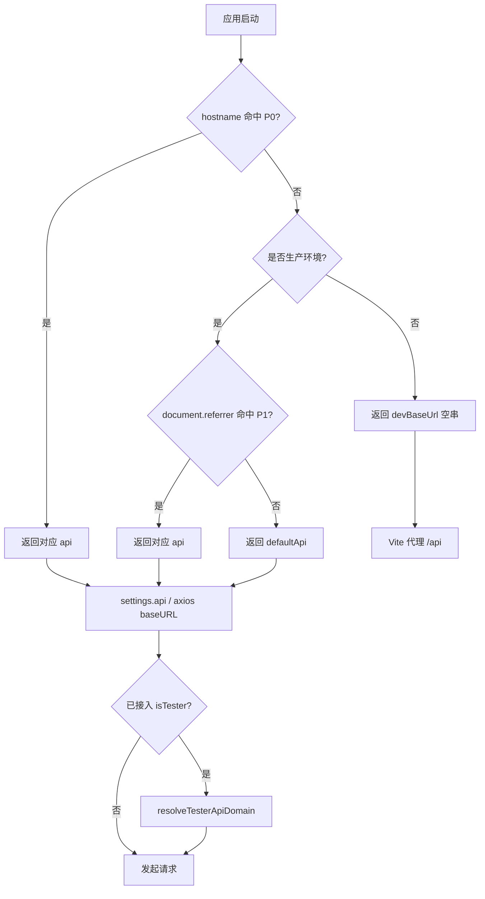

# 基于 Referrer 的多租户 API 域名切换 PRD

## 1. 背景与目标

同一套前端（尤其是 **iframe 嵌入** 场景）需要对接多套后端 API 域名：父页面来自不同业务站时，子应用应自动请求对应环境的 API，避免硬编码单一 `baseURL`、减少部署分叉。

本机制在 **knowledge** 项目中已落地，本文档用于沉淀规范，供其他 React/Vite 项目复用。

**目标：**

- 生产环境：根据 **父页面来源**（`document.referrer`）或 **当前页 hostname** 解析 API `baseURL`
- 开发环境：通过 **Vite 代理** 转发 `/api`，并可选伪造 `Referer` / `Origin` 以模拟线上父站
- 配置化：域名映射、优先级、默认域名均可按项目覆盖
- 低侵入：业务 API 调用仍走统一 `request` / `settings.api`，不分散判断逻辑

**与 isTester 灰度的关系：**

- 本文档机制：决定「**走哪套业务 API 域名**」（多租户 / 多品牌）
- [isTester 灰度 PRD](./isTester-PRD.md)：在已选域名基础上，将 Tester 用户切到 **预发**（如 `api.zcat.cn → pre.zcat.cn`）
- 两者正交，应 **先解析 baseURL，再经 `resolveTesterApiDomain` 处理**（若项目已接入 isTester）

---

## 2. 名词定义

| 术语 | 说明 |
|------|------|
| `document.referrer` | 浏览器提供的上一跳文档 URL；iframe 子页中通常包含 **父页面** 地址 |
| `Referer` 请求头 | HTTP 出站头；本地开发可由 **代理** 伪造，与 `document.referrer` 不是同一概念 |
| API `baseURL` | axios / fetch 使用的 API 根地址，如 `https://api.zcat.cn` |
| 宿主 hostname 规则 | 根据 **当前页** `window.location.hostname` 直接指定 API（优先级高于 referrer） |
| Referrer 规则 | 根据 `document.referrer` 子串匹配指定 API |
| 默认 API | 所有规则未命中时的兜底域名 |

---

## 3. 适用范围（Scope）

### In Scope

- 生产环境 `getApiBaseUrl()`（或等价函数）的解析顺序与配置
- 开发环境 Vite `server.proxy` 的 `target` 与 `headers.referer`
- axios `baseURL` 初始化、相对路径 `/api` 归一化
- 与 isTester、`fetch`/`XHR` 直连 URL 的衔接说明
- 跨项目接入步骤与验收用例

### Out of Scope

- 后端按 Referer 鉴权、CORS 白名单配置（需各后端团队配合）
- CDN、WebSocket、H5 站点的域名策略（可参照 `getWsUrlFromDomain` 等单独扩展）
- 动态运行时切换 API（当前为 **模块加载时一次性** 解析）

---

## 4. 用户故事

- 作为 **iframe 子应用**，当被 `www.kjxhai.cn` 嵌入时，我应自动请求 `api.kjxhai.cn`，无需父页面传参。
- 作为 **独立部署页**（referrer 为空或非目标域），我应请求默认 API（如 `api.zcat.cn`）。
- 作为 **开发者**，本地 `npm run dev` 时希望通过环境变量切换代理目标，并模拟父站 Referer。
- 作为 **架构负责人**，我希望在新项目中复制「配置表 + 一个解析函数 + 代理片段」即可接入。

---

## 5. 功能需求

### FR-1 生产环境 API 解析（核心）

在 **生产构建**（`NODE_ENV === 'production'`）下，按以下 **严格优先级** 解析 API `baseURL`：

| 优先级 | 条件 | 结果（knowledge 现状） |
|--------|------|------------------------|
| P0 | 当前页 `hostname` 匹配宿主规则 | 例：`hostname` 含 `k-t.aix101.com` → `https://api.aix101.com` |
| P1 | `document.referrer` 匹配 referrer 规则 | 例：referrer 含 `kjxhai.cn` → `https://api.kjxhai.cn` |
| P2 | 默认 | `https://api.zcat.cn` |

**实现要点：**

- 使用 `document.referrer`（注意是 DOM API，不是手动设置 axios header）
- `referrer` 读取包在 `try/catch` 中，防止极端环境抛错
- 匹配方式建议为 **子串包含**（`referrer.includes(rule.match)`），便于覆盖 `www.` / 子域
- 解析结果写入全局 `settings.api`，并作为 axios `baseURL`

### FR-2 非生产环境（开发 / 预览）

当 **非生产** 时，`getApiBaseUrl()` 返回 **空字符串** `""`：

- 业务请求使用相对路径：`/api/...`
- 由 Vite（或同类工具）代理到真实后端
- 避免浏览器直连跨域 API，统一走本地代理

### FR-3 开发环境代理与 Referer 伪造

对 `/api` 代理配置：

| 配置项 | 环境变量（建议） | 作用 |
|--------|------------------|------|
| 代理目标 | `LOCAL_API_BASE_URL` / `API_BASE_URL` | 决定 `proxy.target` 指向哪套 API |
| 伪造 Referer | `API_DEFAULT_HEADER_REFERER` | 代理转发时设置 `headers.referer`，模拟父站来源 |
| 伪造 Origin | `API_ORIGIN`（可选） | `proxyReq` 钩子中 `setHeader('Origin', ...)` |

**knowledge 默认行为：**

- `target`：`LOCAL_API_BASE_URL` \|\| `API_BASE_URL` \|\| `https://api.zcat.cn`
- `referer`：`LOCAL_API_BASE_URL` \|\| `API_DEFAULT_HEADER_REFERER` \|\| `https://www.zcat.cn`
- 知识库等特殊路径可单独配置 `proxy` 项（如 `/api/knowledge` → `API_KNOWLEDGE_URL`）

### FR-4 请求路径归一化

- 相对路径统一为 `/api` 前缀（如 `/user/self` → `/api/user/self`）
- 已是 `http(s)://` 的绝对 URL 不再拼接 `baseURL`
- 已是 `/api/` 开头的路径保持原样

### FR-5 与 isTester 的串联（可选）

若项目已接入 isTester：

1. `settings.api = getApiBaseUrl()`（referrer / hostname 决策）
2. axios 请求拦截器：`config.baseURL = resolveTesterApiDomain(config.baseURL)`
3. 绝对 URL、`postStream`、`XHR.upload` 等同样调用 `resolveTesterApiDomain`

**禁止**在 `getApiBaseUrl` 内耦合 isTester，保持职责分离。

### FR-6 可配置化（跨项目复用）

建议抽象为配置对象，例如：

```ts
export interface ApiDomainByReferrerConfig {
  /** 非生产环境返回的空 baseURL，默认 "" */
  devBaseUrl?: string;
  /** P0：当前页 hostname 规则（先匹配先返回） */
  hostnameRules: Array<{ match: string; api: string }>;
  /** P1：document.referrer 规则 */
  referrerRules: Array<{ match: string; api: string }>;
  /** P2：默认 API */
  defaultApi: string;
}
```

业务项目仅需：

1. 在 `src/api/index.ts`（或 `src/config/api.ts`）维护配置表
2. 实现 `getApiBaseUrl(config)` 并在 `settings.api` 初始化时调用一次
3. 在 `vite.config.ts` 同步维护代理与环境变量说明（`.env.example`）

---

## 6. 非功能需求

| 类别 | 要求 |
|------|------|
| 性能 | 解析在模块加载时执行一次，无运行时重复计算开销 |
| 兼容性 | 依赖 `window`、`document.referrer`；仅浏览器环境 |
| 安全性 | 子串匹配需避免过宽规则误伤；敏感环境依赖后端鉴权，不单靠 referrer |
| 可观测性 | 建议 `import.meta.env.DEV` 下 `console.debug` 输出命中规则与最终 `baseURL` |
| 低侵入 | 业务层禁止散落 `if (referrer...)`，统一走 `settings.api` |

---

## 7. 业务规则与优先级（总览）



---

## 8. 异常与边界场景

| 场景 | 行为 | 建议 |
|------|------|------|
| iframe 但 `document.referrer` 为空 | 走默认 API | 检查父页 `Referrer-Policy`；必要时改为 postMessage 传 `parentOrigin` 作为补充方案 |
| `referrer` 被截断为 origin only | 子串匹配仍可能有效 | 规则使用主域名片段（如 `kjxhai.cn`） |
| 用户从 A 站打开子应用再导航 | referrer 可能仍为 A | 符合「首次嵌入来源」语义；若需跟随后续路由需另设计 |
| 直接访问子应用 URL（非 iframe） | referrer 可能为空或非业务域 | 走 defaultApi |
| 生产环境误配 `devBaseUrl` | 会导致请求相对路径无 host | CI 检查 `NODE_ENV` 与 baseURL |
| 多条 referrer 规则同时匹配 | 应采用 **配置顺序第一条** | 文档中写明「先配更具体的规则」 |
| `fetch` / `XHR` 写死绝对 URL | 绕过 `baseURL` | 必须手动拼接 `settings.api` 或走封装 |

---

## 9. 环境变量约定（开发）

建议在项目根目录 `.env.example` 中说明：

```bash
# 本地 API 代理目标（优先）
LOCAL_API_BASE_URL=https://api.zcat.cn

# 备用 API 代理目标
API_BASE_URL=https://api.zcat.cn

# 代理转发时伪造的 Referer（模拟父页面）
API_DEFAULT_HEADER_REFERER=https://www.zcat.cn

# 可选：代理时覆盖 Origin
API_ORIGIN=

# 可选：知识库等独立后端
API_KNOWLEDGE_URL=https://api.zcat.cn
```

---

## 10. 验收标准（UAT）

### 生产 / 预发构建

| 用例 | 前置条件 | 期望 `settings.api` |
|------|----------|---------------------|
| U1 | 部署在含 `k-t.aix101.com` 的域名 | `https://api.aix101.com` |
| U2 | iframe 父页为 `https://www.kjxhai.cn/...`，子页生产环境 | `https://api.kjxhai.cn` |
| U3 | 独立访问，referrer 为空或非 kjxhai | `https://api.zcat.cn` |
| U4 | Referrer-Policy 导致 referrer 为空 | `https://api.zcat.cn`（与 U3 一致） |

### 本地开发

| 用例 | 配置 | 期望 |
|------|------|------|
| D1 | 默认 `.env` | 请求 `/api/*` 被代理到 `api.zcat.cn`，出站带配置 Referer |
| D2 | `LOCAL_API_BASE_URL=https://api.kjxhai.cn` | 代理目标切换，无需改业务代码 |
| D3 | Network 面板 | 浏览器请求 host 为 `localhost`，非直连 API 域 |

### 与 isTester 组合（若已接入）

| 用例 | 条件 | 期望 |
|------|------|------|
| T1 | U3 + `isTester=1` cookie | 最终请求 host 为 `pre.zcat.cn` |
| T2 | U2 + `isTester=1` | 仅当规则包含 `api.zcat.cn` 时才替换；`api.kjxhai.cn` 不受影响 |

---

## 11. 其他项目接入清单

### 11.1 复制/实现

- [ ] 新增 `getApiBaseUrl`（或 `resolveApiBaseUrl(config)`）
- [ ] 配置 `hostnameRules` / `referrerRules` / `defaultApi`
- [ ] `export const settings = { api: getApiBaseUrl(), ... }`
- [ ] axios：`baseURL: settings.api || ''`
- [ ] `vite.config.ts`：`/api` 代理 + `headers.referer` + 可选 `API_ORIGIN`
- [ ] `.env.example` 文档化环境变量
- [ ] （可选）请求拦截器衔接 `resolveTesterApiDomain`

### 11.2 后端协作

- [ ] 确认各 API 域名 CORS 允许子应用源站
- [ ] 若后端根据 `Referer` 做租户识别，与前端 **代理伪造 Referer** 的策略对齐（仅 dev）

### 11.3 嵌入方协作

- [ ] 父页面 iframe 未设置过严的 `Referrer-Policy: no-referrer`
- [ ] 跨域嵌入时 cookie / 登录态方案已单独评估（`withCredentials` 等）

---

## 12. 实施计划（建议）

| 阶段 | 内容 |
|------|------|
| Phase 1 | 抽出 `apiDomainResolver.ts` + 配置类型（可从 knowledge 拷贝改造） |
| Phase 2 | 在项目 A 接入并跑通 UAT |
| Phase 3 | 补充 `.env.example` 与接入 README 链接本 PRD |
| Phase 4 | 推广到项目 B/C，仅改配置表 |

---

## 13. 回滚方案

- **紧急**：`referrerRules` 置空 + 仅保留 `defaultApi`，所有流量回默认域
- **宿主规则误配**：删除或收窄 `hostnameRules` 中的 `match`
- **开发代理问题**：去掉 `headers.referer`，仅保留 `target`

---

## 14. 附录 A：knowledge 项目现状映射

### 14.1 生产解析（`src/api/index.ts`）

```ts
const getApiBaseUrl = (): string => {
  const hostname = window.location.hostname;
  // P0
  if (hostname.includes("k-t.aix101.com")) {
    return "https://api.aix101.com";
  }
  // 非生产 → 走代理
  if (process.env.NODE_ENV !== "production") {
    return "";
  }
  // P1
  try {
    const referrer = document.referrer || "";
    if (referrer.includes("kjxhai.cn")) {
      return "https://api.kjxhai.cn";
    }
  } catch {
    // referrer 可能因隐私策略被限制
  }
  // P2
  return "https://api.zcat.cn";
};

export const settings = {
  api: getApiBaseUrl(),
  // ...
};
```

### 14.2 开发代理（`vite.config.ts` 节选）

```ts
"/api": {
  target: env.LOCAL_API_BASE_URL || env.API_BASE_URL || "https://api.zcat.cn",
  changeOrigin: true,
  headers: {
    referer:
      env.LOCAL_API_BASE_URL || env.API_DEFAULT_HEADER_REFERER || "https://www.zcat.cn",
  },
  configure: (proxy) => {
    proxy.on("proxyReq", (proxyReq) => {
      if (env.API_ORIGIN) {
        proxyReq.setHeader("Origin", env.API_ORIGIN);
      }
    });
  },
},
```

### 14.3 域名对照表（当前）

| 触发条件 | API 域名 |
|----------|----------|
| `hostname` 含 `k-t.aix101.com` | `https://api.aix101.com` |
| 生产 + `document.referrer` 含 `kjxhai.cn` | `https://api.kjxhai.cn` |
| 生产 + 其他 | `https://api.zcat.cn` |
| 非生产 | `""`（相对路径 + Vite 代理） |

---

## 15. 附录 B：推荐的可复用实现草图

```ts
// src/utils/apiDomainResolver.ts
export interface ApiDomainRule {
  match: string;
  api: string;
}

export interface ApiDomainResolverConfig {
  devBaseUrl?: string;
  hostnameRules: ApiDomainRule[];
  referrerRules: ApiDomainRule[];
  defaultApi: string;
  isProduction?: () => boolean;
}

export function resolveApiBaseUrl(config: ApiDomainResolverConfig): string {
  const isProd = config.isProduction?.() ?? import.meta.env.PROD;

  if (typeof window !== "undefined") {
    const hostname = window.location.hostname;
    for (const rule of config.hostnameRules) {
      if (hostname.includes(rule.match)) return rule.api;
    }
  }

  if (!isProd) {
    return config.devBaseUrl ?? "";
  }

  try {
    const referrer = typeof document !== "undefined" ? document.referrer || "" : "";
    for (const rule of config.referrerRules) {
      if (referrer.includes(rule.match)) return rule.api;
    }
  } catch {
    // ignore
  }

  return config.defaultApi;
}
```

```ts
// src/api/index.ts — 业务项目配置示例
import { resolveApiBaseUrl } from "@/utils/apiDomainResolver";

const API_DOMAIN_CONFIG = {
  hostnameRules: [{ match: "k-t.aix101.com", api: "https://api.aix101.com" }],
  referrerRules: [{ match: "kjxhai.cn", api: "https://api.kjxhai.cn" }],
  defaultApi: "https://api.zcat.cn",
};

export const settings = {
  api: resolveApiBaseUrl(API_DOMAIN_CONFIG),
};
```

---

## 16. 附录 C：与 isTester 文档的交叉引用

- isTester 机制：[docs/isTester-PRD.md](./isTester-PRD.md)
- 推荐调用链：`resolveApiBaseUrl()` → `resolveTesterApiDomain(url)` → 发请求

---

## 17. 修订记录

| 版本 | 日期 | 说明 |
|------|------|------|
| 1.0 | 2026-05-25 | 初版，基于 knowledge 项目现状整理，供跨项目复用 |
