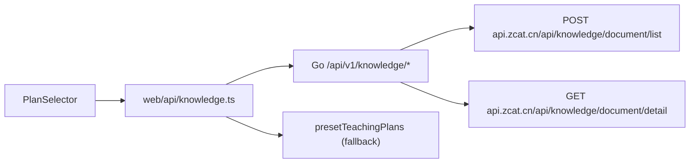

# Design: connect-platform-knowledge

## 架构

## 鉴权

- 前端 axios 经 `buildAuthHeaders(authBridge.getAuthInfo())` 注入平台头
- Go `forwardPlatformHeaders` 原样转发到平台 API（`Authorization`、`X-Bid`、`X-Mvp` 等）

## 上游契约

| 用途 | 方法 | 路径 | 关键参数 |
|------|------|------|----------|
| 教案列表 | POST | `/api/knowledge/document/list` | body: `knowledge_id`, `current`, `pageSize`, `keyword` |
| 教案详情 | GET | `/api/knowledge/document/detail` | query: `document_id` |

`knowledge_id=10298` 对应页面 `teach/knowledge/detail/10298`。

## 字段映射

文档 `document_id/title/desc/content/category_name` → `TeachingPlan`。
